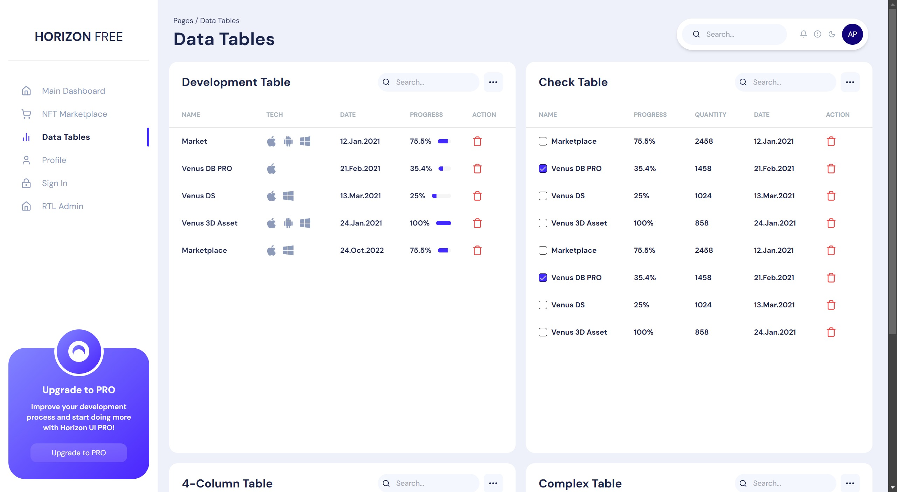

<div align="center">
  <h1 style="border: none;">Sagala Technical Test</h1>
  <div>
    
    
    
  </div>
</div>

## <h3>Screenshot</h3>



## <h3>Quick Start</h3>

Follow these steps to set up the project locally on your machine.

**Prerequisites**

Make sure you have the following installed on your machine:

- [Git](https://git-scm.com/)
- [Node.js](https://nodejs.org/en)
- [npm](https://www.npmjs.com/) (Node Package Manager)

**Cloning the Repository**

```bash
git clone https://github.com/Firkhie/sagala-techtest.git
cd sagala-techtest
```

**Package Installation**

Install the project dependencies using npm:

```bash
npm i
```

**Running the Project**

```bash
npm run dev
```

Open [http://localhost:3000](http://localhost:3000) in your browser to view the project.

#